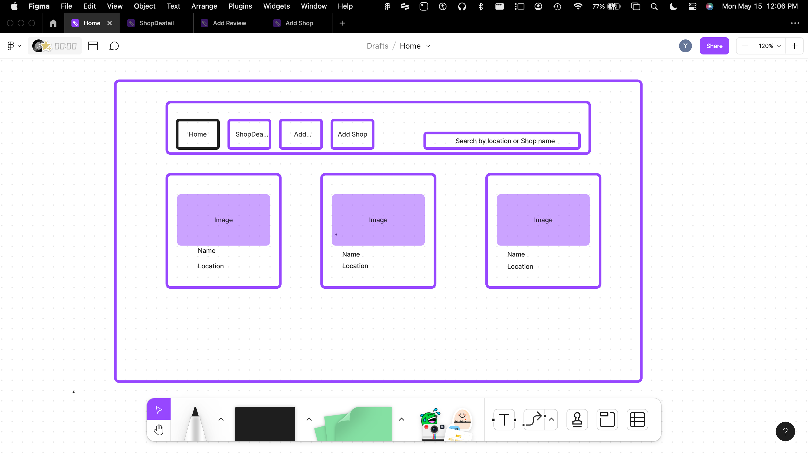
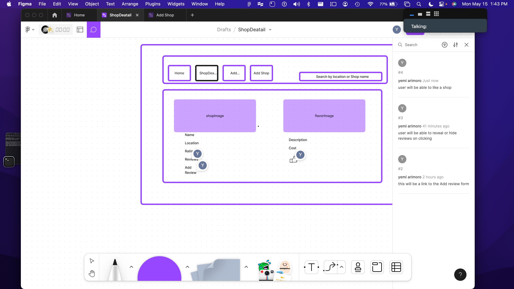
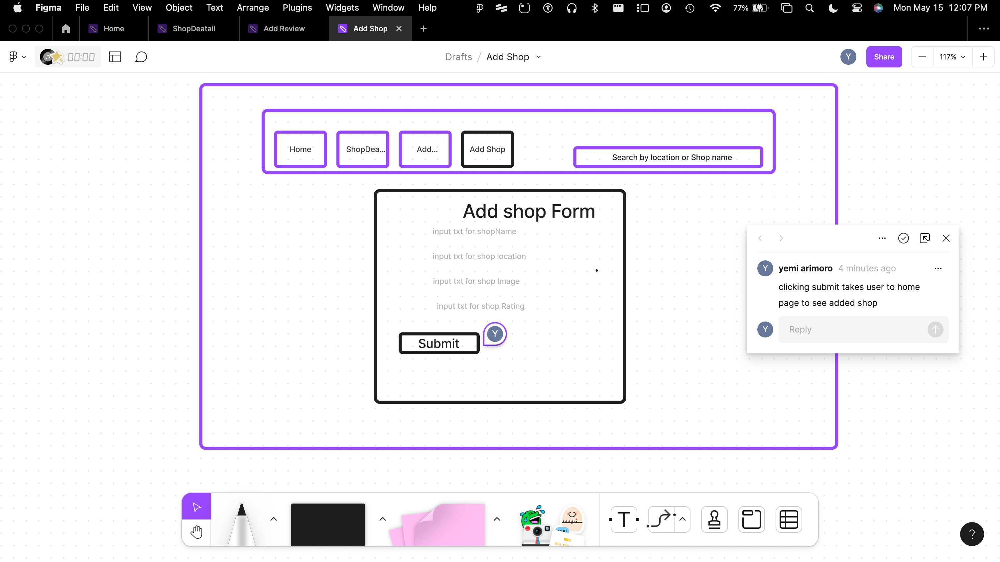
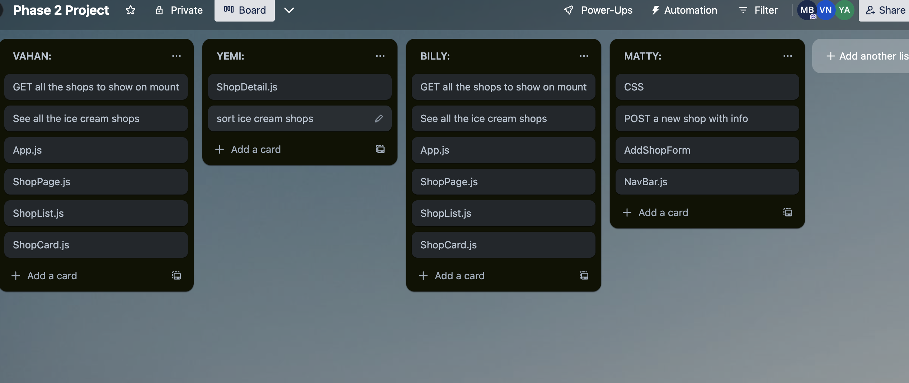
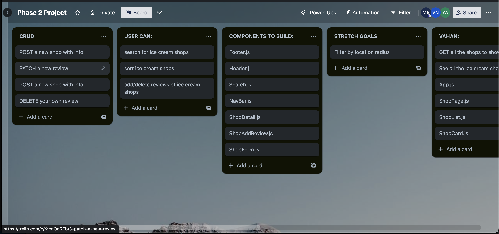
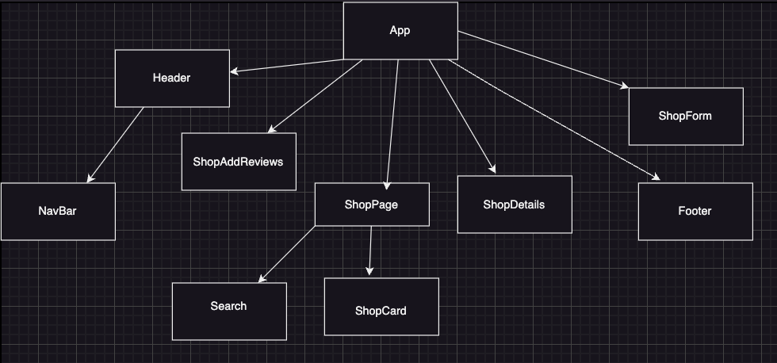

# Ice-Cream-Shop-Finder

User will be able to 
1. View all Ice Cream shops
2. View single shop and its details
3. Like a shop
4. Delete a shop
6. Add a review
7. Sort/Filter to view the shops by likes/reviews/cost
8. Search for a shop

# Client-Side-Routes
| Client Route | Component        |
|--------------|------------------|
| /            | App.js        |
| /addshop     | ShopForm.js      |
| /addreview/:id   | ShopAddReview.js |
| /shopdetails/:id | ShopDetails.js   |

# API-ROUTES

| API Route         | Request Method | Body                                 | Response                             |
|-------------------|----------------|--------------------------------------|--------------------------------------|
| /shops            | GET            |                                      | [{...},{...}]                        |
| /shops            | POST           | {name:, location:, image:, favFlav:} | {id:, name:, image:, favFlav:}       |
| /shops/:id         | PATCH          | {reviews:}                           | {id:,name:,image:,favFlav:,reviews:} |
                        

